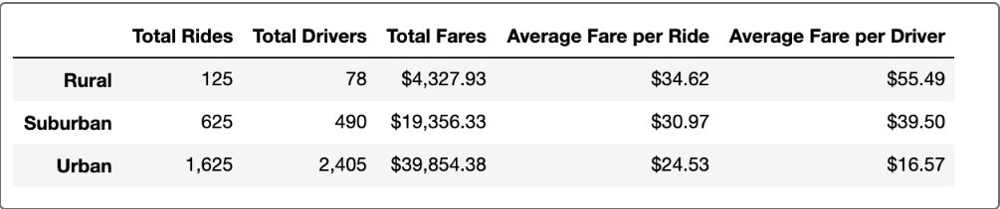
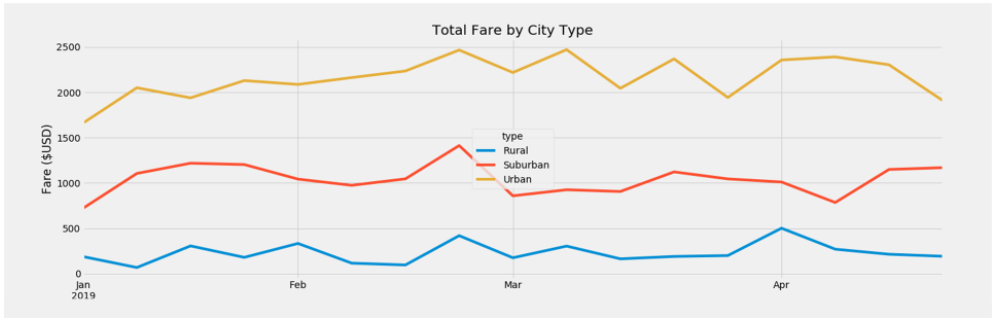

# PyBer_Analysis
## Overview of the Analysis
The purpose of this project was to gain an understanding of the relationship between the amount of drivers, rides, and fares and how these values are effected by the type of city. Each city in the given data set was classified in one of three categories: Rural, Suburban, or Urban. Additionally, through resampling the data into weekly subcategories, additional dataframes and line graphs were created to display the total fares for each week.

## Results
### Table of Average Fares

The data is divided into the city type subcategories of rural, suburban, and urban. Clearly, urban cities have the most riders, drivers, and total fares while rural has the least. For the average fares for each city type, we see a reverse relationship where rural cities have the largest highest fares while urban cities have the lowest average fares. One relationship that can be drawn is that the more total drivers a city has, the cheaper the price of the average fares.

### Line Graph of Total Fares

The graph visually displays the relationship between the total price of fares for each city type. It can be seen that urban cities have the largest fares and rural have the lowest total fares. The table above informs of the average fares price for each city type, however this graph shows total fares. The reason why the total fares for urban cities is the most but the average fares for urban cities is the least is due to driver and ride density. Since there is a much larger quanitity of drivers and rides in urban cities, the average should be lower proportionately. 
## Summary
## 3 Business Recommendations
### Increase Supply of Rides Around the End of February
There is a rise in fares at the later part of February so by increasing supply at this time during the demand spike, an optimal profit can be obtained.
### Increase Supply of Rides At the Start of April in Rural and Urban Cities
In Rural and Urban cities, there is a rise in fares at the start of April, so introducting more drivers and rides into these communities will earn more profit overall since there will be more consumers.
### Remove Drivers in Urban Cities and Transfer them into Rural Cities
Since the individual profit from a fare in rural cities is greater than individual profit from a drive in an urban city, more profit can be earned by sending more drivers in rural cities. Moreover, by transfering drivers rather than hiring more, less money will need to be spent on employment and there should be a short-term shift upwards in fares in urban cities since there will be a lower supply of drivers. 
